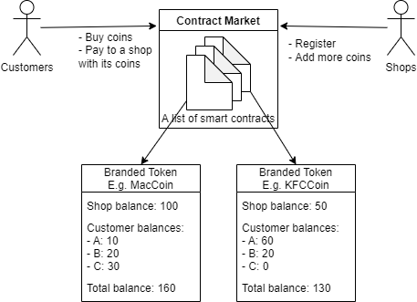

# Smart Contract Development

## Testing
- On Remix (online IDE for Solidity)
    - This approach is suggested for quick review as it does not require environment setup and the actual running blockchain
    - go to [Remix](https://remix-project.org/)
    - enter their editor by online coding or desktop app
    - create files with the same names under the `contracts` folders
    - copy and paste the code to the corresponding files
    - go to the "Solidity compiler" tab and change to the right compiler version (0.5.16)
    - click "compile"
    - Go to "Deploy & run transactions" tab and deploy the desired contract(s) (TokenContractMarket)
- On UST workstation
    - open a terminal on the workstation installed with `truffle` and `solc` and type `geth attach <target port>` (current port with a running blockchain is `http://127.0.0.1:8543`). The *Geth JS console* will open up.
    - if you hope to create a new account, type `personal.newAccount('seed')`
    - type `personal.unlockAccount(web3.eth.coinbase, "seed", 15000)` to unlock the account
    - to check the balance: ```web3.fromWei(eth.getBalance(eth.coinbase), "ether")```
    - to start and stop mining:
    ```
    > miner.start()
    > miner.stop()
    ```
    - start mining
    - open another terminal. Type `truffle console` to open up the truffle console.
    - run the following command to access the contract
    ```
    > var <variable_name>
    > <contract_name>.deployed().then(function(instance) { <variable_name> = instance; })
    // example
    > var dApp
    > TokenContractMarket.deployed().then(function(instance) { dApp = instance; })
    ```
    - then try out the functions from the smart contract by calling
    ```
    > <variable_name>.<function_name>(<parameters>)
    // example
    > dApp.registerNewToken("MCoin", "coin of shop M", "M", 5000)
    ```

## Current contracts
- `TokenContractMarket.sol`
    - functions
        - `registerNewToken`: register a new token to the market with its detail and initial balance
        - `addShopBalance`: provide additional coins to a requesting shop
        - `mintToken`: create coins for a requesting customer (transfer from shop to customer)
        - `payToShopOfBrand`: pay to the shop for a requesting customer (transfer from customer to shop)
        - `getTokenDetail`: get the detailed information of a token (currently just the coin name)
        - `listAllRegisteredToken`: list all the tokens that have been registered in the market (logging is not readable currently. Will fix later)
        - `showBalance`: show the balance of a kind of token of a specified customer
- `BrandedToken.sol`
    - functions
        - `addShopBalance`: increase the balance of coins of the shop (used when shops request to have more coins)
        - `mint`: create coins for a requesting customer (transfer from shop to customer)
        - `payToShopOfBrand`: pay to the shop for a requesting customer (transfer from customer to shop)
        - `getTokenDetail`: get the detailed information of a token (currently just the coin name)
        - `getBalance`: show the balance of a specified customer
        - `isBalanceValid`: validate whether the balances by checking if total balance == sum of balance of the shop & all customers

## Structure
- `TokenContractMarket` is the marketplace for issuing and managing smart contracts for different kinds of token.
- When a shop registers with us, after approval, a smart contract `BrandedToken` will be deployed specifically for this shop. The data / information about this shop's coins will be stored and managed in this contract, including the balances of coins of the shop and all customers.
- Whenever a shop or customer want to do transactions or manage their balance, they can access the marketplace and make the request. The marketplace contract will process their request by calling the `BrandedToken` contract for that shop.
- High-level concept of the contract structure:  


## Remarks
- current status: implementing the basic logic for this project
- future targets
    - review whether the structure is approriate and safe
    - enhance security by adding more validations
    - enhance privacy by setting approriate access controls
